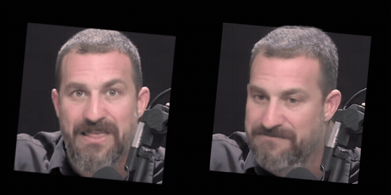
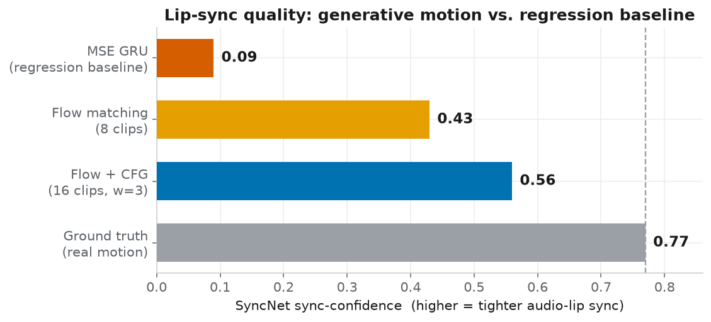
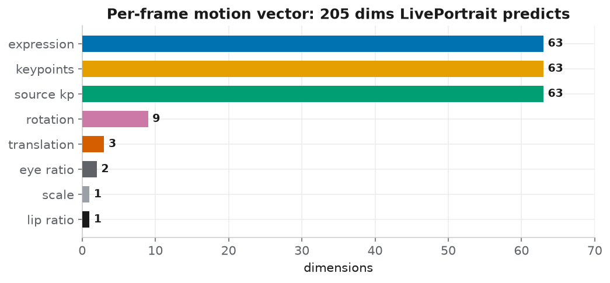
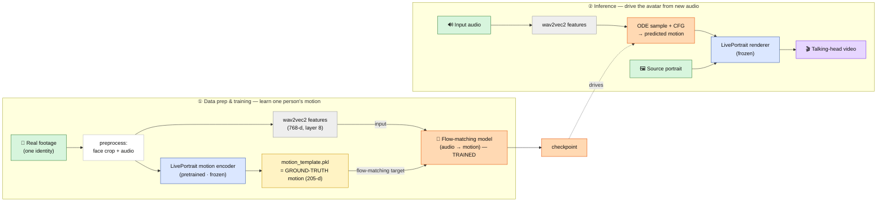
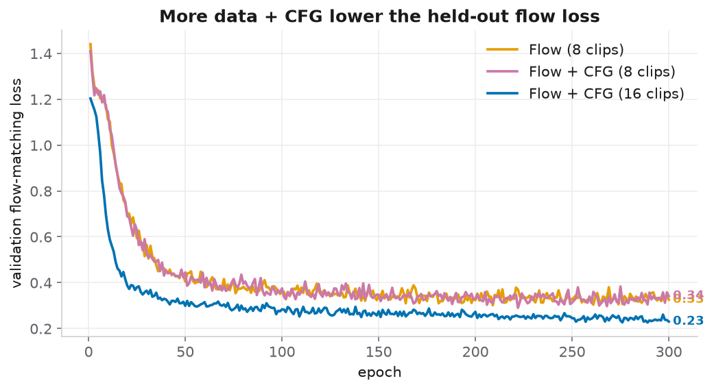
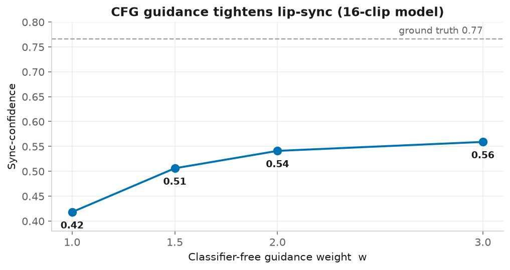
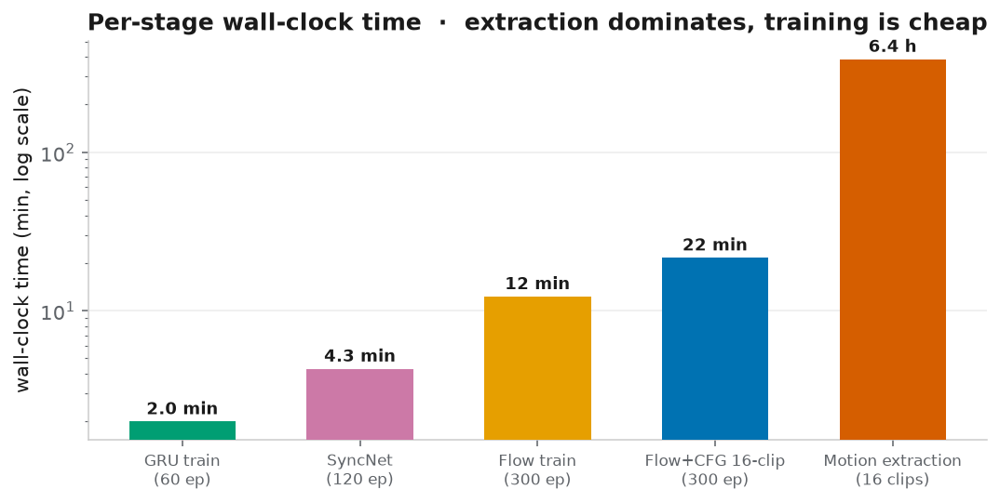

# Persona-Motion — Audio-Driven Talking-Head Synthesis

**Generate a personalized talking-head video of a target person from speech audio, by learning that person's *facial-motion dynamics* rather than their pixels.** A generative sequence model maps `wav2vec2` audio features to a 205-dimensional per-frame motion representation, which a frozen, pretrained [LivePortrait](https://github.com/KwaiVGI/LivePortrait) renderer turns back into video.

<p align="center">
  <br/>
  <em>Left: ground-truth footage &nbsp;·&nbsp; Right: generated from audio (flow + CFG, 16-clip model).</em><br/>
  <sub>From the second half of the clip · <a href="docs/assets/demo/demo_second_half.mp4">full second-half render with audio (mp4)</a></sub>
</p>

> **About this demo:** the audio is a segment of a real Andrew Huberman podcast; the right panel is our model driving a single source portrait. This clip's timeline was **part of training** (windowed within-clip split, see below), so it demonstrates **same-speaker reconstruction quality**, *not* identity or out-of-distribution generalization — which this person-specific model does not claim. See [Limitations](docs/limitations.md).

---

## TL;DR

- **Problem reduction:** instead of learning audio → pixels (huge, data-hungry), learn audio → a **205-d motion vector per frame**, and let a pretrained portrait animator render it. The learning target is the motion LivePortrait *extracts from real footage* — not the video, not a render.
- **Key finding:** MSE regression to motion coefficients **collapses to the mean → a frozen, mumbling face.** Reframing motion prediction as a **generative flow-matching** problem restores full-amplitude, natural motion. **Classifier-free guidance (CFG)** then tightens lip-sync further.
- **Measured on a learned SyncNet lip-sync metric** (ground truth = 0.77):

  | Model | Sync-confidence |
  |---|---|
  | MSE GRU (regression baseline) | **0.09** |
  | Flow matching (8 clips) | **0.43** |
  | Flow + CFG (16 clips, w=3) | **0.56** |

  

- **Built and trained end-to-end on the Bowdoin Slurm HPC:** audiovisual preprocessing, ~6.4 h GPU motion extraction per 16-clip dataset, and generative-model training, with round-trip tooling for job submission, monitoring, and artifact retrieval.

---

## What this is / isn't

| | |
|---|---|
| ✅ A **learned audio→motion** model (flow matching + CFG) trained from scratch on facial-motion coefficients | ❌ Not a fork/wrapper that "just runs LivePortrait" |
| ✅ A full **audiovisual data pipeline**: face crop → motion extraction → wav2vec2 → aligned windows | ❌ Not trained on pixels; the renderer is frozen and reused as-is |
| ✅ A **quantitative evaluation** harness (learned SyncNet sync metric + per-component motion error) | ❌ Not claiming cross-identity generalization — it is person-specific |
| ✅ Real **HPC/Slurm engineering** (GPU selection, checkpoint recovery, Exclusive_Process fixes) | ❌ Not a research paper with novel architecture claims |

---

## Problem definition

| | |
|---|---|
| **Input** | speech audio (16 kHz) |
| **Conditioning** | `wav2vec2` features (768-d, layer 8), resampled to the motion frame grid |
| **Output** | a sequence of **205-d LivePortrait motion vectors**, one per video frame |
| **Temporal resolution** | 20 fps motion (audio features resampled onto it) |
| **Rendering** | frozen pretrained LivePortrait warps a single source portrait along the predicted motion |
| **Training target** | the motion template LivePortrait **extracts from the person's real footage** |
| **Objective** | rectified flow-matching velocity loss (generative), vs. MSE for the regression baseline |

**Why not predict pixels?** Audio→video is extremely high-dimensional and needs large paired datasets. LivePortrait already solves one-shot portrait animation from a motion template. So the project reduces the learning problem to **audio → a compact motion code**, which is tractable from ~1 hour of a single speaker's footage.

The **205-d motion vector** (per frame) is the concatenation LivePortrait uses:



---

## System architecture



Deep dives: **[architecture](docs/architecture.md)** · **[data pipeline](docs/data_pipeline.md)** · **[training](docs/training.md)** · **[evaluation](docs/evaluation.md)** · **[experiments](docs/experiments.md)** · **[compute](docs/compute.md)** · **[reproducibility](docs/reproducibility.md)** · **[limitations](docs/limitations.md)**

---

## Technical contributions

| Layer | Status |
|---|---|
| **LivePortrait** (portrait animator + motion encoder) | **Pretrained, frozen, reused** — thin external checkout, not vendored |
| **wav2vec2** audio encoder | **Pretrained, frozen** feature extractor (layer 8) |
| Audio→motion **models** (`motion_flow`, `motion_gru`, `motion_transformer`, `motion_tcn`, `motion_cvae`) | **Implemented & trained from scratch** in this repo |
| **Rectified flow matching + CFG** for motion generation | **Implemented from scratch** — the core modeling contribution |
| **SyncNet** audio↔motion sync discriminator + sync-confidence metric | **Implemented & trained from scratch** as an objective evaluator |
| Audiovisual **data pipeline** (face crop, motion extraction, wav2vec2, alignment, windowing, normalization) | **Implemented from scratch** |
| **HPC/Slurm** orchestration & round-trip tooling | **Implemented from scratch** |

**What's technically distinctive** (all implemented and measured here, not just integrated):
- **Motion-space generative modeling** — reframing a task usually posed as regression as **flow matching**, which fixes the mean-collapse ("frozen face") failure mode. Ablated against the MSE baseline on a learned sync metric.
- **Classifier-free guidance for motion** — audio-dropout training + guided ODE sampling; a guidance-weight sweep shows monotonic lip-sync gains.
- **A learned lip-sync evaluator** (SyncNet-style, CLIP-style in-batch contrastive) that gives an objective number where MSE would be misleading.
- **Windowed within-clip temporal split** + z-scored, rotation-orthonormalized motion targets, with `record.fps`-exact audio↔motion alignment (fixing a drift bug from `int`-truncated fps).
- **Systems work:** diagnosed and fixed a LivePortrait render failure on Exclusive_Process GPUs (CPU-side prediction so the renderer owns the single CUDA context), plus template-salvage recovery and cache-on-scratch fixes.

---

## Model architecture (real parameter counts)

| Model | Params | Config | Checkpoint |
|---|---|---|---|
| **Flow + CFG (final)** | **14.69 M** | motion 205, audio 768, hidden 512, **3-layer BiGRU**, time-embed 128 (sinusoidal), dropout 0.1 | 176 MB (w/ optimizer) |
| GRU baseline | 1.30 M | in 768 → hidden 256, 2-layer, dropout 0.2 | 15.6 MB |
| SyncNet (evaluator) | 5.05 M | dual BiGRU encoders, embed 256, contrastive | 20.2 MB |

The flow model predicts the **rectified-flow velocity field** `v(x_t, t, audio)`: motion, audio, and a sinusoidal time embedding are projected and summed, passed through a bidirectional GRU (O(T), whole clips in one pass), and decoded by an MLP head. Sampling integrates `dx/dt = v` from Gaussian noise via Euler ODE; CFG combines conditional and unconditional fields as `v = v_uncond + w·(v_cond − v_uncond)`. See **[architecture](docs/architecture.md)**.

---

## Results & experiments

13 training runs across two identities (HDTF "CMR", Andrew Huberman) trace the full progression. Highlights:

<p align="center">
  
  
</p>

- **Doubling the data** (8→16 clips) lowered held-out flow loss 0.33 → **0.23** and raised sync 0.43 → 0.56.
- **CFG guidance** monotonically improved sync (w=1→3: 0.42 → 0.56) and snapped the audio↔motion offset peak to **0** (proper time alignment).
- **Audio-encoder ablation** (GRU): richer features → lower motion-regression loss (prosody → mel → wav2vec2).

Full table with dates, commits, hyperparameters, and outcomes: **[docs/experiments.md](docs/experiments.md)**.

---

## Compute & systems



- **Training** ran on **NVIDIA RTX 2080** nodes; generative training is cheap (GRU ~2 min, flow ~12 min, flow+CFG/16-clip ~22 min for 300 epochs).
- **Motion extraction** (driving LivePortrait over every real frame) is the dominant cost: **~6.4 h on an RTX Pro 6000** per 16-clip dataset.
- Orchestrated via **Slurm** with custom round-trip scripts (submit → poll → fetch), robust monitoring, checkpoint recovery, and GPU-compatibility fixes. See **[docs/compute.md](docs/compute.md)**.

---

## Quickstart

> Requires Python ≥ 3.10, `ffmpeg`/`ffprobe`, and (for training/inference) a PyTorch-capable environment. LivePortrait and its weights live in an external checkout. Full instructions + a dataset-free smoke test: **[docs/reproducibility.md](docs/reproducibility.md)**.

```bash
python -m venv .venv && source .venv/bin/activate
pip install -e .            # library + CLIs
pip install -e .[train]     # + torch, for training/inference

# Regenerate all figures from the committed experiment logs (no HPC needed):
python3 scripts/make_portfolio_figures.py
```

Core pipeline (see per-command help and [docs/reproducibility.md](docs/reproducibility.md)):

```bash
python scripts/preprocess_dataset.py    --input clip.mp4 --identity-id my_id      # video → crops + audio
python scripts/extract_motion.py        --manifest-path .../manifest.jsonl ...    # → 205-d ground-truth motion
python scripts/extract_wav2vec_features.py --manifest-path .../manifest.jsonl     # → wav2vec2 features
python scripts/train_flow.py            --config configs/train_flow_w2v_cfg.yaml ...  # train flow+CFG
python scripts/render_predicted_motion.py --checkpoint best.pt ...                # audio → video
python scripts/eval_sync_confidence.py  --checkpoint syncnet.pt ...               # objective lip-sync metric
```

---

## Repository layout

```text
src/avagen/         library: data · features · models · training · inference · evaluation · renderers
scripts/            CLIs (preprocess, extract, train, predict, render, evaluate) + HPC round-trip tools
configs/            YAML configs for every stage & experiment variant
slurm/              Slurm job templates (preprocess, extract, train, render)
tests/              21 unit/smoke tests
docs/               architecture · data · training · evaluation · experiments · compute · limitations · reproducibility
docs/assets/        figures (reproducible), demo GIFs, raw experiment logs
```

---

## Limitations & responsible use

This is a **person-specific** model trained on ~1 hour of one speaker; it does **not** generalize to new identities, and the demo above is same-speaker reconstruction, not held-out generalization. Known issues include residual jitter, weak eye/blink dynamics, and dependence on clean frontal footage. Synthetic talking-head video carries real misuse risk — **use only with identities and footage you are authorized to use.** Full discussion: **[docs/limitations.md](docs/limitations.md)**.

---

## Skills demonstrated

Deep learning (generative flow matching, CFG, contrastive learning) · computer vision (face tracking, motion coefficients) · audio processing (wav2vec2, mel/prosody) · sequence modeling (BiGRU/temporal design, windowing, alignment) · data engineering (audiovisual pipeline from long-form footage) · HPC/Slurm · experiment tracking & evaluation · reproducible tooling. Resume-ready bullets: **[docs/resume.md](docs/resume.md)**.
